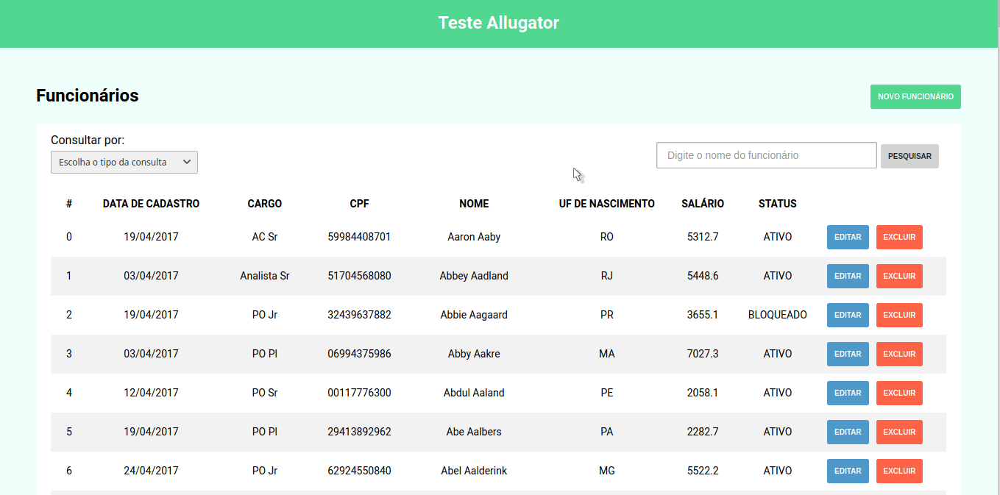

<h1 align="center">Teste Allugator (Frontend)</h1>



# Uso

## Pre-requisitos

Para iniciar esse projeto é necessário primeiramente instalar todas as dependências e tecnologias para executar o ambiente de desenvolvimento.

- [Node](https://nodejs.org/en/) & NPM/[Yarn](https://yarnpkg.com/)

### Instalar dependências

```sh
$ npm install
```
ou
```sh
$ yarn
```

## Execução

Após o download de todas as tecnologias e dependências, basta seguir esses passos:

1. Copie o arquivo env.example e coloque os valores corretos para as variáveis de ambiente:
```sh
$ cp .env.example .env
```
2. Execute o projeto em modo de desenvolvimento:
```sh
$ npm run start
```
ou
```sh
$ yarn start
```

## Tecnologias utilizadas

- [X] ReactJS e Typescript;
- [X] Styled-components;
- [X] Axios;
- [X] React-toastify;
- [X] ESLint e Editorconfig;
